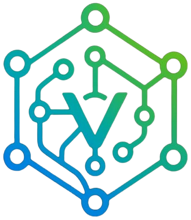

  
  
  # 🚀 Ricardo Vendramini Cassimiro
  ### **Proprietário & Desenvolvedor @ Vendramini Informática**
  
  

  

    
    
    
    
  

---

### 👨‍💻 Sobre Mim

Sou fundador e desenvolvedor responsável pela **Vendramini Informática**, empresa focada em criar soluções tecnológicas de ponta, sistemas de alta performance e experiências web imersivas para negócios e clientes finais em Piracicaba/SP e região.

- 🌐 **Web Full-Stack & SaaS**: Desenvolvimento de plataformas completas em **React 18, TypeScript, Vite, Tailwind CSS** e **Supabase** (Auth, RLS, Storage, Realtime).
- ⚡ **High Performance & Canvas 2D**: Criação de interfaces ricas com **HTML5/CSS3 Vanilla, Glassmorphism e Canvas API 2D** (efeitos de partículas, matrizes e renderizações dinâmicas em tempo real sem frameworks pesados).
- 🔄 **Arquiteturas Híbridas & PWAs**: Construção de aplicações preparadas para uso offline com **LocalStorage Fallback**, Service Workers PWA e automação de orçamentos integrada à API do WhatsApp.
- 🐍 **Python & Game Dev**: Desenvolvimento de jogos 2D com **Pygame** (lógica de colisão AABB, máquinas de estados, geração de frequências de áudio 8-bit em tempo real) e utilitários Desktop em **Tkinter**.
- 🌀 **Ambiente de Trabalho**: Desenvolvendo primariamente sob o ecossistema **Linux Debian**.

---

### 🛠️ Tecnologias & Ferramentas

#### **Linguagens & Core**

#### **Frameworks, UI & Web APIs**

#### **Backend, Cloud & Banco de Dados**

#### **Ferramentas & Sistema Operacional**

---

### 🌟 Projetos em Destaque

| Projeto | Descrição & Recursos | Stack Principal | Links |
| :--- | :--- | :--- | :---: |
| 🏢 **Elite House Hub** | Plataforma imobiliária completa (CRM, Gestão de Imóveis, Clientes, Financeiro, Agendamento e Analytics). | `React 18` `TypeScript` `Vite` `Supabase` `Tailwind` `PWA` | [🌐 Live](https://elitehousepiracicaba.com.br) • [📦 Repo](https://github.com/rik-404/eliteHouseOficial) |
| ⚡ **Vendramini Informática** | Site oficial institucional com efeito Matrix animado via Canvas API e apresentação do CRM **VendraX**. | `HTML5` `CSS3` `JS ES6+` `Canvas API` `PWA` | [🌐 Live](https://vendraminiinformatica.com.br/) |
| 🪄 **Fundo Mágico** | Ferramenta interativa que gera backgrounds CSS dinâmicos a partir de descrições em texto com Glassmorphism. | `HTML5` `CSS3` `JS ES6+` `Dynamic CSS Parser` | [📦 Repo](https://github.com/rik-404/Fundo-Magico-) |
| 💖 **Festa Fácil** | Vitrine & Catálogo de Orçamentos com busca em tempo real, gestão no Admin e envio direto para WhatsApp. | `HTML5` `CSS3` `JS ES6+` `Supabase` `LocalStorage Fallback` | ⚡ *Production* |
| 🔮 **Cigana Morgana** | Landing Page mística com efeito de estrelas (starfield) interativo ao mouse via Canvas 2D e Lightbox. | `HTML5` `CSS3 Glassmorphism` `Canvas API 2D` `JS` | ⚡ *Production* |
| 🛍️ **Catatau Eletrônicos** | Plataforma e-commerce para eletrônicos com painel administrativo integrado ao Supabase SQL. | `HTML5` `CSS3` `JS Vanilla` `Supabase DB/Auth` | ⚡ *Production* |
| 👽 **Retorno dos Aliens** | Jogo de nave arcade retrô 2D com máquina de estados e sintetização matemática de sons 8-bit. | `Python 3` `Pygame` `Math Sound Synthesis` | 🎮 *Game* |
| ⏳ **Calculadora Data/Hora** | Aplicação Desktop GUI para cálculo preciso de intervalos e conversões temporais. | `Python 3` `Tkinter` `Datetime API` | 🖥️ *Desktop* |

---

### 📊 Estatísticas do GitHub

  
  

 

  

---

### 📬 Vamos Conversar & Conectar!

  
  
  [_98231--6964-25D366?style=for-the-badge&logo=whatsapp&logoColor=white)](https://wa.me/5519982316964)
  
  
  

   

  © 2026 **Ricardo Vendramini Cassimiro** • Desenvolvido com dedicação & tecnologia.

